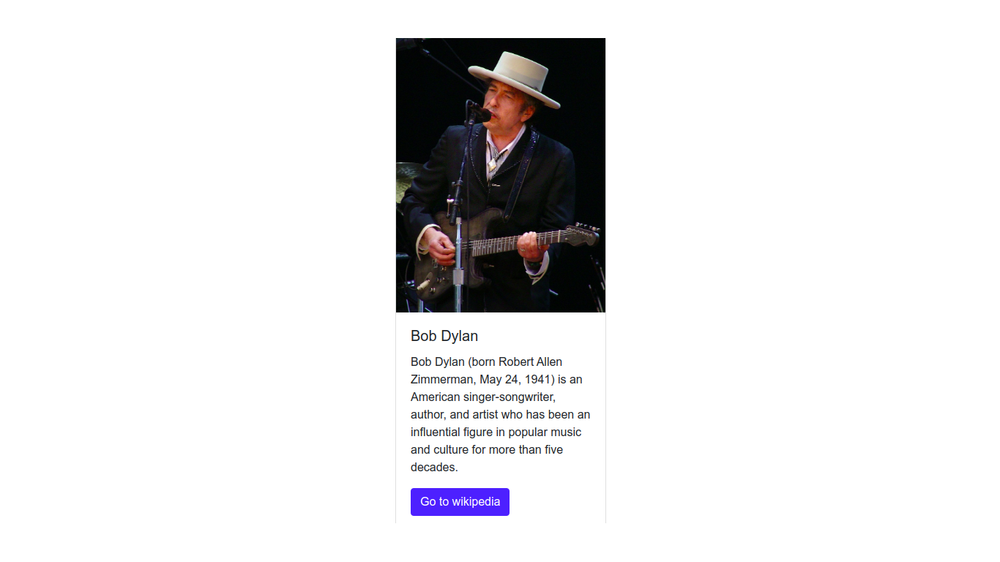

# `03` Aufbau eines Layouts

Lass uns ein bisschen mehr über die Verwendung von JSX für die Erstellung von HTML üben.

Jetzt haben wir ein weiteres Objekt, das ein bisschen komplexer ist als das letzte.

# :speech_balloon: Anweisungen

Du hast ein `data`-Objekt, das Bob Dylans Informationen enthält (Bild, Titel, etc.).

```js
const data = {
  image: "https://upload.wikimedia.org/wikipedia/commons/thumb/0/02/Bob_Dylan_-_Azkena_Rock_Festival_2010_2.jpg/800px-Bob_Dylan_-_Azkena_Rock_Festival_2010_2.jpg",
  cardTitle: "Bob Dylan",
  cardDescription: "Bob Dylan (born Robert Allen Zimmerman, May 24, 1941) is an American singer/songwriter, author, and artist who has been an influential figure in popular music and culture for more than five decades.",
  button: {
    url: "https://en.wikipedia.org/wiki/Bob_Dylan",
    label: "Go to wikipedia"
  }
};
```

Verwende die in `data` enthaltenen Informationen, um z.B. eine Bootstrap-Karte zu erstellen: Der Titel der Karte ist der `data.cardTitle`, usw.

Hier ist der HTML-Code für die Erstellung einer Karte in Bootstrap:

```html
<div class="card m-5">
  
  <div class="card-body">
    <h5 class="card-title">Card title</h5>
    <p class="card-text">Some quick example text to build on the card title and make up the bulk of the cards content.</p>
    <a href="#" class="btn btn-primary">Go somewhere</a>
  </div>
</div>
````
Quelle: [Bootstrap Card](https://getbootstrap.com/docs/4.0/components/card/#example)

### So muss dein Endergebnis aussehen:



